# CS7641 Project Fake News Detection Algorithm
#### Kai Sun, Xiyang Wu, Xuesong Pan, Ruize Yang

## 1. Introduction 

People are spending more time on social media nowadays. Therefore misleading information could cause serious problems. A lot of people are having a difficult time classifying all the information they receive, so an algorithm detecting fake news would be useful for many.  

The goal of this project is to create and compare models for accurate prediction of fake news datasets. We start with a brief description of the data set used in the development of this project, processing and analysis on the data, followed by each of the various algorithms we implemented, and finally the performance of each model.

## 2.Data set and Basic idea

The data set used in training and testing the detection systems comes from Kaggle fake news <a href="https://www.kaggle.com/c/fake-news/data">(link)</a>. Kaggle is an online community of data scientists and machine learning practitioners and offering public datasets for algorithm testing. Kaggle fake news dataset is a set of 20799 news article with fake (or not) label. Each data has 5 attributes:

1. **id:** unique id for a news article;
2. **title:** the title of a news article; 
3. **author:** author of the news article; 
4. **text:** the text of the article (could be incomplete); 
5. **label:** a label that marks the article as potentially unreliable, 1 for unreliable and 0 for reliable.

### Data Processing: Vectorize the sentences

The method we use to process the raw sentences is the Doc2Vec method. The Doc2Vec method [5] is a modified algorithm based on the Word2Vec [6] method. The basic idea for the Word2Vec method is to map each word in the sentence into the vector and use the words in the rest part of the article to predict the next word. The prediction could be taken as a multi-class classification problem, while the generated vector contains the probability that each word in the dictionary exists in the next position. The Doc2Vec method introduces an extra unit on the top of each sentence that represents the ‘topic’ of the given sentence. In this case, each sentence could be mapped into the vector space and processed together, instead of being processed separately. In our project, the Doc2Vec method is used to process the dataset for all the machine learning method except the LSTM methods.

In this project, our work mainly involves analyzing the texts. In order to reduce noise, we removed all the stop words and punctuations, then convert each article to sentences to further break down the weight each unique word carries.

We focused on mining particular linguistic cues, like, by finding anomalous patterns of pronouns, conjunctions, and words associated with negative emotional word usage. For example, that fake news often contains an inflated number of swear words and personal pronouns. The raw news be represented using the Bag-of-Words model, which then be modified to incorporate the relativity between the words. We used both supervised and unsupervised learning here.  For unsupervised learning, we used Kmeans and GMM; for supervised learning, we used Naive Bayes Classfier, SVM and XGBoost; for deep learning, we experimented LSTM and a two layer neural network.

## 3.Unsupervised Method
### 3.1 K-means

K-means is one of the simplest unsupervised learning algorithms that solve the clustering problem. Here we use the the K-Means in scikit-learn clustering module. It classifies given dataset into a per-fixed number of clusters (k clusters). In each iteration, the first step is to define k centroids, one for each cluster. The next step is to take each point in the given data set and assign it to the nearest centroid. When no point is left, this iteration is completed and an early clustering is done. When starting the next iteration, the k centroids are re-calculated as the center of all the data points in each clusters resulting from the previous step. The steps are repeated until the sum of distance between each data point and its corresponding centroids is minimized.

### 3.2 Gaussian Mixture Model

In GMM clustering, each cluster is modelled as a different Gaussian distribution. Instead of the hard assignment in K-Means, GMM makes flexible soft clustering, which means each data point could be generated by any of the distributions with a corresponding probability. In effect, each distribution has some "responsibility" for generating a particular data point. A latent variable is introduced for every data point to represent from which Gaussian it is generated. The latent variable is estimated through Expectation Maximization (EM) Algorithm. In E-step, the latent variables are estimated; in M-step, the weight and parameters of each distribution are estimated using MLE. This process is repeated until the algorithm converges. 

## 4.Supervised Method
### 4.1 Naive Bayes Classifier 

Naive Bayes is a relatively simple algorithm, but it is often found to have very good results in the field of NLP content analysis. Here we use the naive Bayes class library in scikit-learn to classify the data. Compared to decision trees, algorithms like KNN, Naive Bayes requires fewer parameters. In scikit-learn, there are 3 naive Bayes classification algorithm classes. They are GaussianNB, MultinomialNB and BernoulliNB. Among them, GaussianNB is naive Bayes with priori Gaussian distribution, MultinomialNB is naive Bayes with priori polynomial distribution, and BernoulliNB is naive Bayes with priori Bernoulli distribution.

### 4.2 Support Vector Machine

SVM is a fast and dependable classification algorithm that performs very well with a limited amount of data. The objective of the SVM algorithm is to find a hyperplane in an N-dimensional space that distinctly classifies the data points and also has the maximum distance to the nearest data point of each label. The SVM kernel is a function that takes low dimensional input space and transforms it to a higher dimensional space so that it converts non-separable problem to separable problem. It is mostly useful in non-linear separation problem.

### 4.3 XGBoost

XGBoost is one of the most popular and efficient implementations of the Gradient Boosted Trees algorithm. Boosting is a ensemble method that creates a strong classifier from a number of weak classifiers. In gradient tree boosting, new decision trees are created to predict the errors made by existing trees; new trees are added to the model on at a time using a gradient descent-like procedure, while the previous trees in the model are unchanged. XGBoost is generally faster compared to other implementations of gradient boosting with optimization of the original algorithm. It dominates the classification and regression modeling problems of small-to-medium structured/tabular data.

## 5. Deep Learning Method

Deep learning based method is an effective tool in the document classification field, especially for the tasks with complicated features. Generally, deep learning based method is a subclass of the supervised learning, while the neural network is trained by presenting the expected label for each data point. In this project, we intend to present two kinds of Deep learning based methods: the traditional backward-propagation neural network and the LSTM network.

### 5.1 Backward-propagation Neural Network

The traditional backward-propagation neural network [7] uses the fully-connected layer to store the learnt parameters. The forward propagation process generates the output with the current parameter, and the backward propagation process uses the error between the current output and the ideal one to update the weight for each neural unit in each iteration. 

The neural network for the fake news classification task has three layers in general. The structure of the neural network is shown in Fig. 1. The first layer, which is the layer to read the primitive training data, has 300 input channels and 256 output channels. The hidden layer in the middle has 256 input channels and 80 output channels. The third layer, which the last one, has 80 input channels and 2 output channels. The activation function used between each layer in the middle is the ReLU function, while the activation function for the output layer is the sigmoid function, in order to fix the scope for the output values. To avoid the potential overfitting issue, which is common in the NLP tasks, two dropout layers are introduced between the first and second layer, and the second and third. These layers could randomly drop the neural nodes in the previous layer during the training process. To discuss effect of the dropout layers on the network, the dropout rate is changeable during the implementation. 

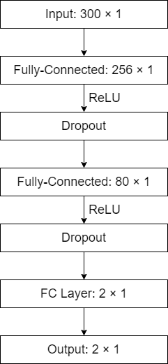

Fig 1. The structure of the backward-propagation neural network

### 5.2 LSTM Network

Long Short-Term Memory (LSTM) Network [8] is a neural network with recurrent structure. This deep learning model reveals impressive capability in processing the continuous sequences, since this model could find out and utilize the relationship between different samples in the same sequence. In this project, we will design two kinds of LSTM network for fake news detection, the LSTM network with single propagation direction and the bi-directional LSTM network.
The structure of the neural network is shown in Fig. 2. Unlike other method, the vectorize method for the LSTM network is the word embedding method.  In this case, the sentence read by the network is an array with fixed length, and the content in the index of each word in the dictionary that contains the words with highest frequency. The vectorized sentences are sent into the embedding layer, so that each word in the sentence will be presented as a vector that presents its similarity with other words. The vector length for each word is 10. The LSTM network used for this project includes 300 input channels, which corresponds to the length of each sentence, and 150 hidden states. The activation function for the LSTM layer is ReLU. The sum of the elements in the vector that represents each word is calculated after the LSTM layer, and the result is sent into the fully connected layer with 150 input channels and 2 output channels. Two dropout layers locate after the embedding layer and the LSTM layer. The activation function for the output layer is the sigmoid function.

As a modified version of the original LSTM network, bidirectional LSTM network (Bi-LSTM) could encode the input sentences in both directions, which makes it capable to process more complex sentences. The general structure of the Bi-LSTM network is similar to the original LSTM network. The main difference between these network is that the Bi-LSTM network has LSTM units for backward propagation, so that the output size for the Bi-LSTM layer is twice as the original LSTM layer. 

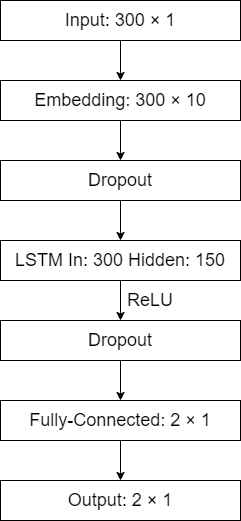

Fig 2. The structure of the LSTM network

## 6. Model Evaluation and Data Analysis

### 6.1 Data Analysis

First, we did an analysis of clustering using our dataset. We used Word2Vec to create word embeddings for our articles. Following this, we used the word vectors to create a KMeans model with 10 clusters. We picked the closest words to the centroids of these clusters and then displayed the 5 closest words in the figure below.

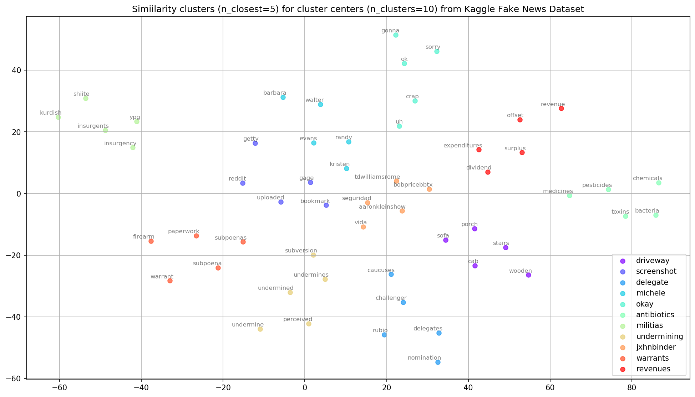

Fig 3. KMeans clustering of Kaggle Fake News dataset

Our analyses then consisted of boxplots for 2 different metrics: percentage of capital words as well as title length for both reliable and unreliable articles. From the percent capital words title, we can tell that unreliable articles seems to have more capital words. Similarly, the number of words for fake article titles seems to be lower, with a higher spread. From these two figures, we can see that titles with more than about 30 words are more likely to be fake. 

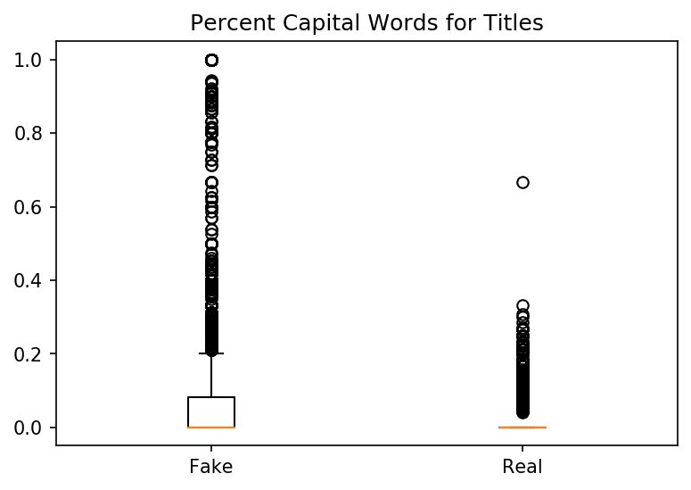

Fig 4. Boxplot for percent capital words in title

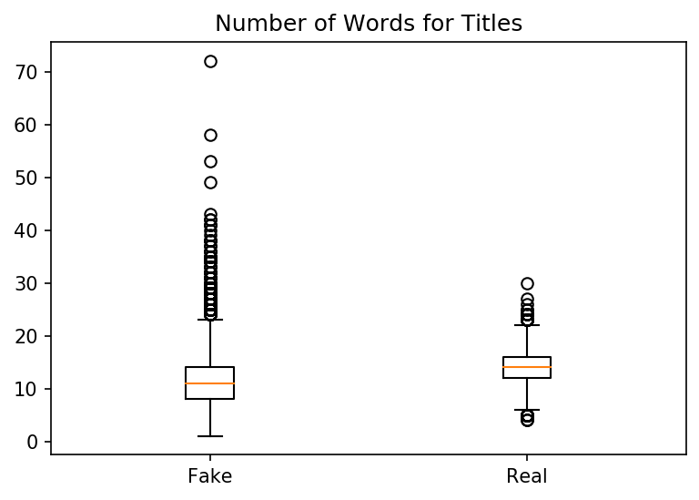

Fig 5. Boxplot for number of words in title

We also performed a word count for the top5 words in each category:

- Top 5 words&frequencies for unreliable articles: 
  - 20170 trump
  - 19296 clinton
  - 16600 people
  - 16128 one
  - 14942 us

- Top 5 words&frequencies for reliable articles:
  - 68179 said
  - 64571 mr
  - 36119 trump
  - 22803 would
  - 22542 one

We cannot draw any conclusions from the words, but it's interesting to see how politics would affect our accuracy ratings in the future.

### 6.2 Results for Unsupervised Learning Models
#### K-Means
Accuracy 56.42%

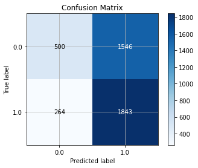

Fig. 6 The confusion matrices for Kmeans

#### Gaussian Mixture Model
Accuracy 65.37%

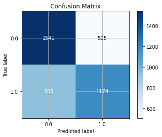

Fig 7. The confusion matrices for Gaussian Mixture Model

### 6.3 Results for Supervised Learning Models
#### Naive Bayes Classifier 

We tried all three naive Bayesian models of sklearn. Among them, the polynomial model and the Bernoulli model perform relatively well, and can reach 0.902 and 0.908 after parameter adjustment(show in below), respectively. but the Gaussian model performs poorly, reaching only 0.7. The reason why the Gaussian model is less effective may be because it is mainly used in continuous random variables, but text analysis belongs to discrete variable analysis. The difference between the polynomial model and the Bernoulli model have different calculation granularities. The polynomial model uses words as the granularity, and the Bernoulli model uses files as the granularity. Therefore, the calculation methods of the a priori probability and the class conditional probability are different. When calculating the posterior probability, for a document B, in the polynomial model, only the words that have appeared in B will participate in the posterior probability calculation. While in the Bernoulli model, if a word does not appear in B but appeared in the global word list, those words will also participate in the calculation, but only as the "counter party". Therefore, the judgment criterion of the Bernoulli model is more comprehensive, which may be the reason why it is slightly better than the polynomial model. 

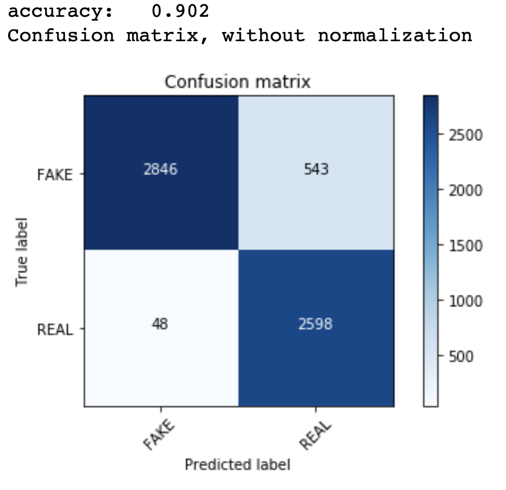

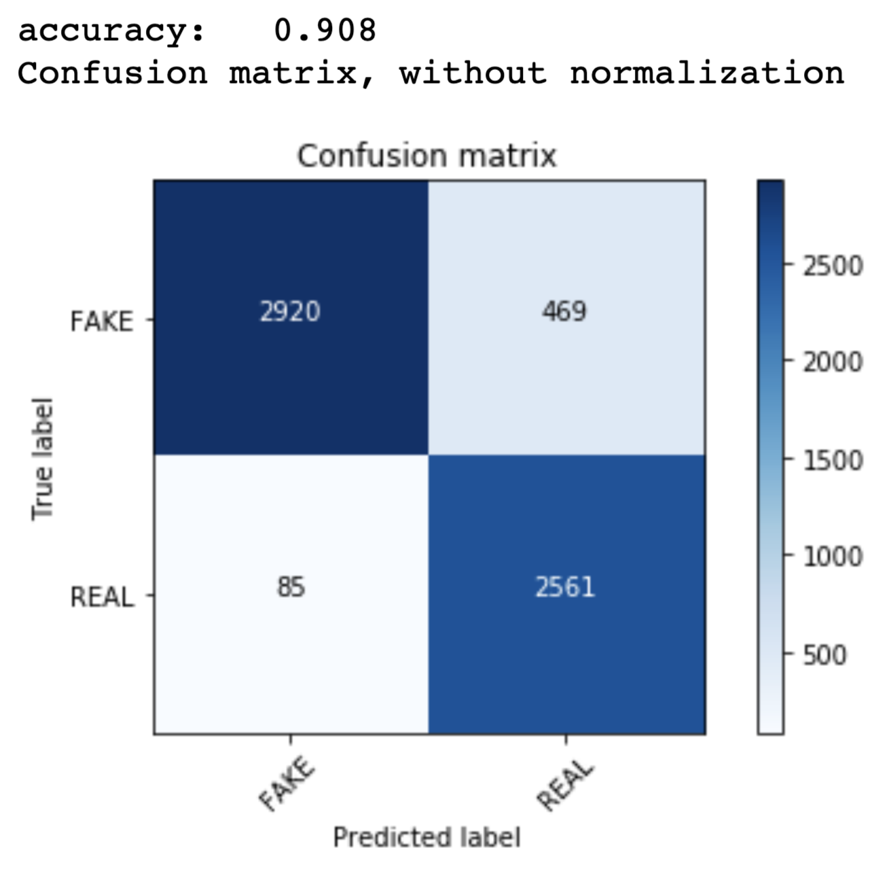

Fig 8. The confusion matrices for Naive Bayes Classifier: (a) Multinomial NB; (b) Bernoulli NB

However, the Naive Bayes model only classifies from a priori probability point of view, its classification effect will be worse than the deep learning model which have more complicate structure and much more parameters.

#### Support Vector Machine
Accuracy 93.43%

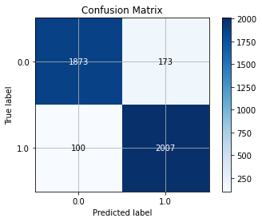

Fig 9. The confusion matrices for Support Vector Machine

#### XGBoost
Accuracy 91.16%

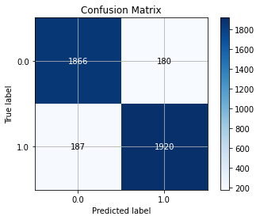

Fig 10. The confusion matrices for XGBoost

### 6.4 Deep Learning Methods
#### Backward-propagation Neural Network
During the implementation, the BP neural networks are trained for 1000 epochs. The optimization method is SGD, with the learning rate of 0.01 and the 0.9 momentum. Using the Doc2Vec vectorize method, the entire dataset is sent into the model during each iteration.  Since the fake news detection task could be taken as a binary classification task, which has two kinds of labels (Real or Fake), the loss function for all the networks is BCE loss function.

The dropout rate for performance comparison is 0 (No dropout layer), 0.1, 0.3, 0.5, 0.7. As a binary classification problem, the output size for all the networks is 2. The expected class for the given label is the class with greater probability. The general performance of each network will be judged by the classification accuracy, while the number of the parameters for each network will also be provided.

#### LSTM
Since the LSTM based neural networks are much more complicated than the BP network, the training parameters are different. The LSTM and Bi-LSTM network are trained for 50 epochs. The optimization method is SGD, with the learning rate of 0.01 and the 0.9 momentum. Considering the size of the input torch object, the entire dataset will be divided into several batches. The batch size during training and testing is 100. The loss function for this project is BCE loss function as well. Considering the structure of the model as well as the well the learning rate, the loss is scaled by 50 times for the mono-directional LSTM network, and 40 times for the Bi-LSTM network, to update the weights more effectively. The dropout rate used for performance comparison is the same as the ones for the BP neural network.

#### Results
The overall classification accuracy result for each neural network is shown in Table. 1. For the traditional BP neural network, its number of parameters is 97778. The best classification result happens when the dropout rate equals to 0, which is 93.81%, though all the classification accuracy results are approximately the same. The confusion matrix for this situation is shown in Fig. 3(a).  For the LSTM network, its number of parameters for the LSTM model is 321522. The best classification result happens when the dropout rate equals to 0.3, which is 93.83%. The confusion matrix for this situation is shown in Fig. 3(b).  For the Bi-LSTM network, its number of parameters is 593022. The best classification result happens when the dropout rate equals to 0.5, which is 92.85%. The confusion matrix for this situation is shown in Fig. 3(c).  

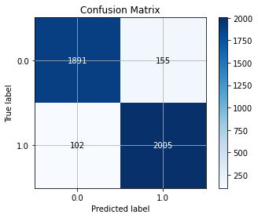

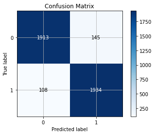

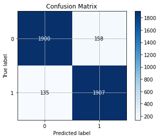

Fig 11. The confusion matrices for (a) BP Neural Network; (b) LSTM; (c) BiLSTM

Table 1. The classification accuracy for each neural network

| Network \ Dropout Rate      | 0     | 0.1    | 0.3    | 0.5    | 0.7    |
| ---------- | :-----------:  | :-----------: | :-----------: | :-----------: | :-----------: |
| BP Neural Network     | 93.81%     | 93.50%    | 92.97%    | 93.23%    | 92.68%    |
| LSTM     | 89.51%     | 91.85%    | 93.83%    | 93.07%    | 90.22%    |
| BiLSTM     | 88.59%     | 91.66%    | 92.66%    | 92.85%    | 91.07%    |

According to the result, we can find that the best classification accuracies for the BP Neural Network model and the LSTM model are approximately the same, while the accuracy for Bi-LSTM model is slightly lower. The reason for this might be overfitting, since the LSTM and Bi-LSTM model use much more parameters than the BP Neural Network model. The dropout layer, on the other hand, has little effect on the BP Neural Network, while affects the performance of the LSTM and Bi-LSTM model heavily. The classification accuracy of the  LSTM and Bi-LSTM model when dropout rate is 0.3 and 0.5 is much better than the rest situations. When the dropout rate is too low, overfitting could happen due to the excessive parameters. If too many parameters are dropped out, the model might not converge with the remaining parameters. Besides, the complexity of the network structure should be appropriate. A more complex network, like the Bi-LSTM network, may not necessarily lead to a better performance. During the training process, we find that the classification accuracy can increase to 99.6% on the training dataset, when using a LSTM model with two extra fully-connected layers. However, the classification accuracy remains around 80% on the testing dataset, which is obviously caused by overfitting.

## 7.Conclusions

In general, supervised methods performed a lot better compared to unsupervised methods based on accuracy, and all deep learning methods provide very high accuracy models. It's also impotant to test with different parameters and set margin to avoid overfitting. 

## References

1. Ward A, Ross L, Reed E, et al. Naive realism in everyday life: Implications for social conflict and misunderstanding[J]. Values and knowledge, 1997: 103-135.
2. Nickerson R S. Confirmation bias: A ubiquitous phenomenon in many guises[J]. Review of general psychology, 1998, 2(2): 175-220.
3. Shu K, Sliva A, Wang S, et al. Fake news detection on social media: A data mining perspective[J]. ACM SIGKDD Explorations Newsletter, 2017, 19(1): 22-36.
4. Thota, Aswini, et al. “Fake News Detection: A Deep Learning Approach.” SMU Data Science Review, vol. 
5. Le, Quoc, and Tomas Mikolov. "Distributed representations of sentences and documents." International conference on machine learning. 2014.
6. Mikolov, Tomas, et al. "Distributed representations of words and phrases and their compositionality." Advances in neural information processing systems. 2013.
7. Rumelhart, David E., Geoffrey E. Hinton, and Ronald J. Williams. Learning internal representations by error propagation. No. ICS-8506. California Univ San Diego La Jolla Inst for Cognitive Science, 1985.
8. Hochreiter, Sepp, and Jürgen Schmidhuber. "Long short-term memory." Neural computation 9.8 (1997): 1735-1780.

